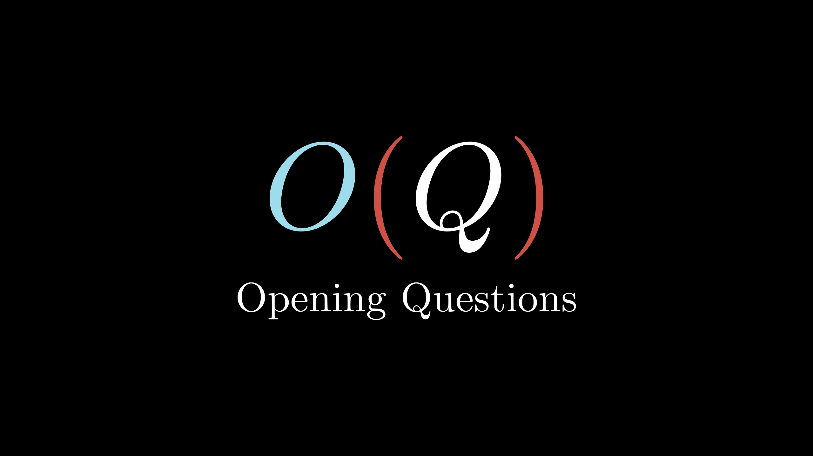

## About
Code for videos on the [Opening Questions](https://www.youtube.com/channel/UCRQ5gGxixCkYamF5S3sU1hA) Youtube channel.

Opening Questions is here to make resources for people to learn and engage with computer science, programming, math and science (and how they have developed throughout history), and philosophy.

Projects with source code will have links to their own repositories.

The animations are made with the manim math animation engine, which was originally made by Grant Sanderson for 3b1b. Many thanks to Grant for creating this powerful tool, sharing it with the world, and making videos that help us see what's wonderful about math.

- [3b1b/manim on Github](https://github.com/3b1b/manim)
- [3b1b on Youtube](https://www.youtube.com/channel/UCYO_jab_esuFRV4b17AJtAw)
- [www.3blue1brown.com](https://www.3blue1brown.com/)

Please see [Jonathan-Llovet/opening-questions-manim](https://github.com/Jonathan-Llovet/opening-questions-manim) for details on usage, extensions from the manim community that I have used in my scenes, recommendations for learning manim, and links to other manim-related projects.
